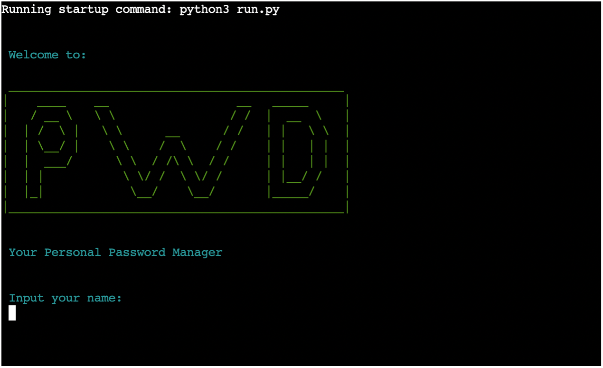
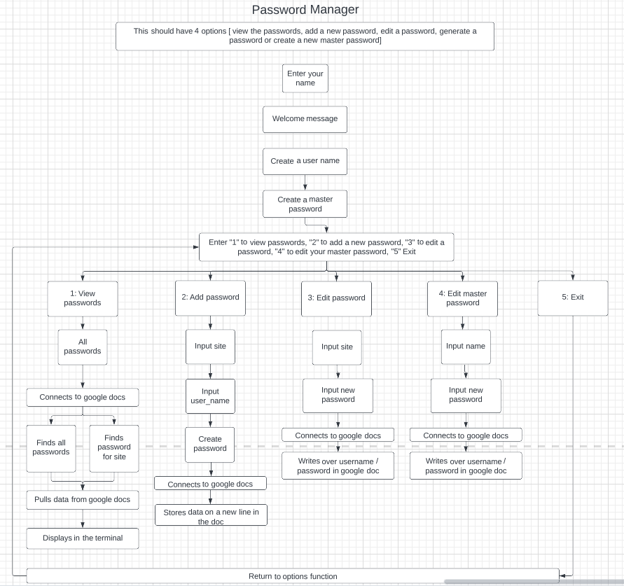
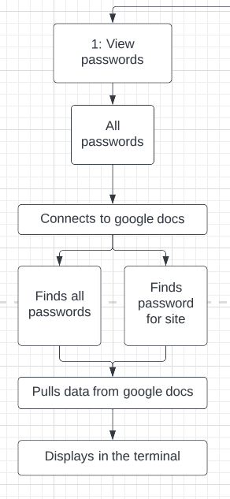
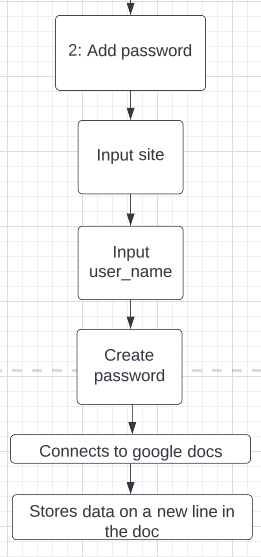
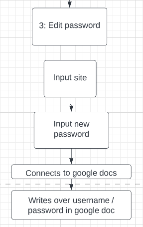
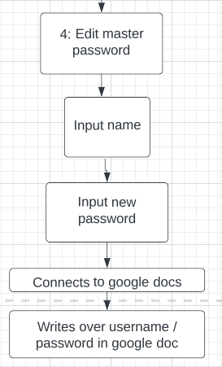
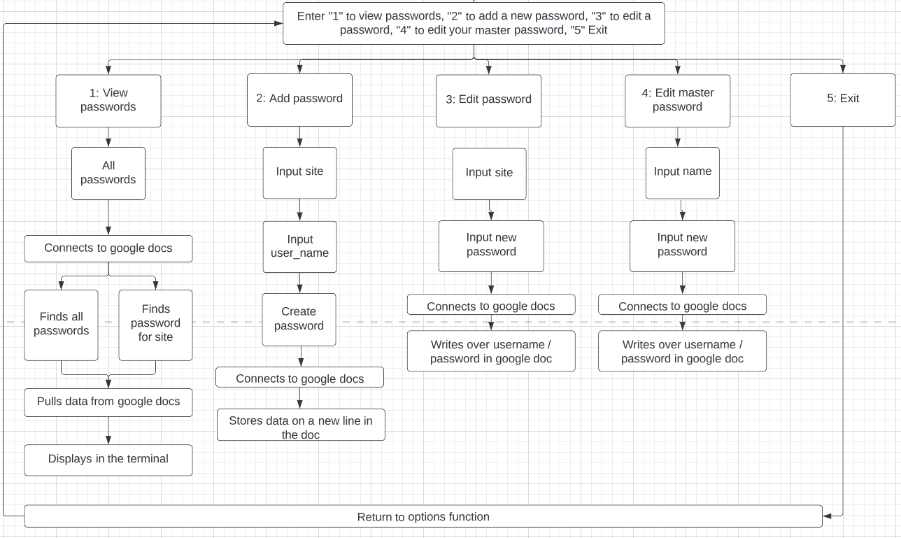

# Personal Password Manager
(Developer: Christopher Faherty)

[Live Webpage](https://ci-pp3-ppm.herokuapp.com/)

## About

This is a command line verson of a password manager.

This password manager allows stores one main account. It then allows that user to View add and edit their passwords.

With the pace of everything going digital and everyone having different accounts for everything its human nature to take the easy route and use the same password for every account. This has a huge impact on your security and shows why password managers are vital today more than ever.

## Table of Content

1. [Project Goals](#project-goals)
    1. [User Goals](#user-goals)
    2. [Return User Goals](#returning-user)
    3. [Site Owner Goals](#site-owner-goals)
2. [User Experience](#user-experience)
    1. [Target Audience](#target-audience)
    2. [User Requirements and Expectations](#user-requirements-and-expectations)
    3. [User Stories](#user-stories)
3. [Design](#design)
    1. [Design Choices](#design-choices)
    2. [Colour](#colour)
    3. [Fonts](#fonts)
    4. [Structure](#structure)
    5. [Wireframes](#wireframes)
4. [Technologies Used](#technologies-used)
    1. [Languages](#languages)
    2. [Framework and Tools](#framework-and-tools)
5. [Features](#features)
6. [Testing](#testing)
    1. [Testing user stories](#testing-user-stories)
8. [Bugs](#bugs)
9. [Deployment](#deployment)
10. [Credits](#credits)
11. [Acknowledgements](#acknowledgements)

## Project Goals

### User Goals
* Storing my passwords and connecting them to a username and website,
* View all my passwords in the terminal,
* Add new passwords as required,
* Find and edit a specific password,
* Edit the master accounts password.

### Site Owner Goals
* Create a password managar that I would use myself,
* Create an easy flow for the user to navigate the terminal,
* Provide feedback when the user inputs incorrect information.

## User Experience

### Target Audience
* People that find it hard to remember a lot of passwords,
* People with a lot of online accounts,
* People looking to improve their online security.

### User Requirements and Expectations
* A welcome screen with a short description of what the site is,
* A easy to follow flow of information,
* Feedback if the incorrect value in input,
* Passwords to be presented in an easy to read format,
* Color codeing to help guide the User,

### User Stories

#### First-time  User
1. I want to have a clear flow to the site,
2. I want to be able to create a master username and password to protect my passwords.
3. I want to have clear options displayed when dicisions are to be made.
4. I want to be able to view all my passwords in an organised form.
5. I want to be able to easly add new passwords.
6. I want to be able to edit my master password or user passwords if required.
7. I want to be able to get feedback if i enter something incorrectly. 

#### Site Owner
8. I want users to enjoy the experiance to make their personal password manager,
9. I want users to to easily navigate the site,
10. I want users to be able to use the functions with out an issue,
11. I want users to know if there was an issue and how to resolve it.

## Technical Design

### Flowchart

The following flowchart sumerises the structure of the password manager.

Overview

Options

Exit Loop

## Technologies Used

### Languages
* [Python](https://www.python.org/) The language used for the logic of the project.

### Framework and Tools
* [Git](https://git-scm.com/) Used for version control to push the code to GitHub.
* [GitHub](https://github.com/) Used as a repository to store the projects code.
* [lucidchart](https://www.lucidchart.com/) Used to create the project flow.
* [Google Cloud Platform](https://cloud.google.com/cloud-console/) Used to manage access and permissions Google auth & sheets to google services.
* [Google Sheets](https://www.google.co.uk/sheets/about/) Used to store the passwords.
* [Heroku Platform](https://www.heroku.com) Used to deploy the project.

### Libraries

#### Python Libraries
* [Time](https://docs.python.org/3/library/time.html) - Used to delay the user input after the welcome message is displayed.
* [PrettyPrinter](https://docs.python.org/3/library/pprint.html) - Used pprint to display the passwords in a organised format for option 1.

#### Third Party Libraries
* [colorama](https://pypi.org/project/colorama/) Used add colow to the Welcome message. It was also used to help the user notice if something was sucessful with green and an error with red.
* [gspread](https://docs.gspread.org/) Used gspread to add and manipulate data in my Google spreadsheet and to interact with Google APIs.
* [google.oauth2.service_account](https://google-auth.readthedocs.io/en/master/) Used to set up the authentification needed to access the Google API and connect my Service Account with the Credentials function. A creds.json file was created with all details the API needs to access the google account.
* 

## Features

### Existing Features

* N

* T

* T

* T

* I

* S

 * F

 * 4

### Features Left to Implement
* A feature that I would like to implement in the future 

## Testing

* T

### Validator Testing
* PEP8
    * No errors were found when passing the site pages through the [official W3C validator](https://validator.w3.org/)

    

Password Manager

    
    

### Testing user stories
1. I want to have a clear flow to the site.

| **Feature** | **Action** | **Expected Results** | **Actual Result** |
|-------------|------------|----------------------|-------------------|
| I | R | L | W |

Screenshots

2. I want to be able to create a master username and password to protect my passwords.

| **Feature** | **Action** | **Expected Results** | **Actual Result** |
|-------------|------------|----------------------|-------------------|
| S | C | L | W |

Screenshots

3. I want to have clear options displayed when dicisions are to be made.

| **Feature** | **Action** | **Expected Results** | **Actual Result** |
|-------------|------------|----------------------|-------------------|
| F| C | O | W |

Screenshots

4. I want to be able to view all my passwords in an organised form.

| **Feature** | **Action** | **Expected Results** | **Actual Result** |
|-------------|------------|----------------------|-------------------|
| G | C  | r | W |

Screenshots

5. I want to be able to easly add new passwords.

| **Feature** | **Action** | **Expected Results** | **Actual Result** |
|-------------|------------|----------------------|-------------------|
| G | C  | r | W |

Screenshots

6. I want to be able to edit my master password or user passwords if required.
| **Feature** | **Action** | **Expected Results** | **Actual Result** |
|-------------|------------|----------------------|-------------------|
| F | C | O | W |

Screenshots

7. I want to be able to get feedback if i enter something incorrectly.  

| **Feature** | **Action** | **Expected Results** | **Actual Result** |
|-------------|------------|----------------------|-------------------|
| S | C | L | W |

Screenshots

8. I want users to enjoy the experiance to make their personal password manager.

| **Feature** | **Action** | **Expected Results** | **Actual Result** |
|-------------|------------|----------------------|-------------------|
| F | S | o | W|

Screenshots

9. I want users to to easily navigate the site.

| **Feature** | **Action** | **Expected Results** | **Actual Result** |
|-------------|------------|----------------------|-------------------|
| I | o | L | W|

Screenshots

10. I want users to be able to use the functions with out an issue.

| **Feature** | **Action** | **Expected Results** | **Actual Result** |
|-------------|------------|----------------------|-------------------|
| F | C | O | W |

Screenshots

11. I want users to know if there was an issue and how to resolve it.

| **Feature** | **Action** | **Expected Results** | **Actual Result** |
|-------------|------------|----------------------|-------------------|
| G | S | L | W|

Screenshots

## Bugs

### fixed Bugs
* When edinting the master password if you intered the user name instead of the name it would print the new password in the incorrect cell.
    * Change the function to focus on the one cell as this cell will not change.
* When locating the specific row and column for edit password the function would break if the coordinates where past row 9.
    * An if else statement was added so the formula changes once the cell is past row 9.
* When adding websites you could add the same one a few times but then to change the password it would change the first one it found.
    * A function was created to search for that website before adding a new one to the spread sheet. If there was one in the sheet already it would give a prompt to change the name so it is different to what is currently stored.

## Deployment

### Forking the GitHub Repository
* Go to the GitHub repository,
* In the top right hand corner you can click on the fork button,
* This will fork the repositry.

## Credits
* I

## Acknowledgements
I would like to take the opertunity to thank:
* My Mentor Mo Shami for the great feedback productive meetings and guiding me to finishing this project.
* I would also like to thank the Code institute team for all the support and material to assist with this project.